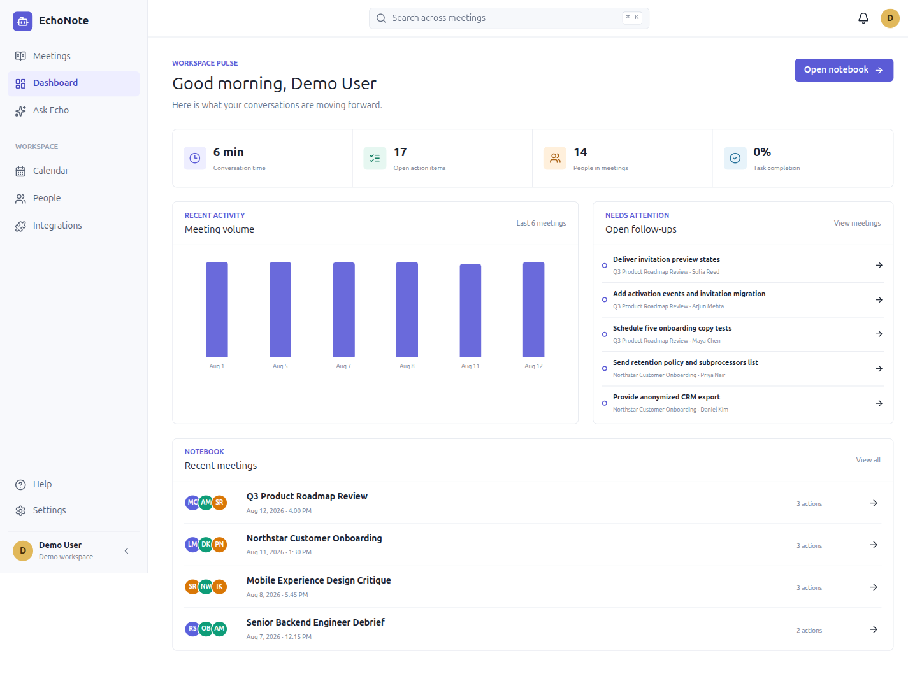
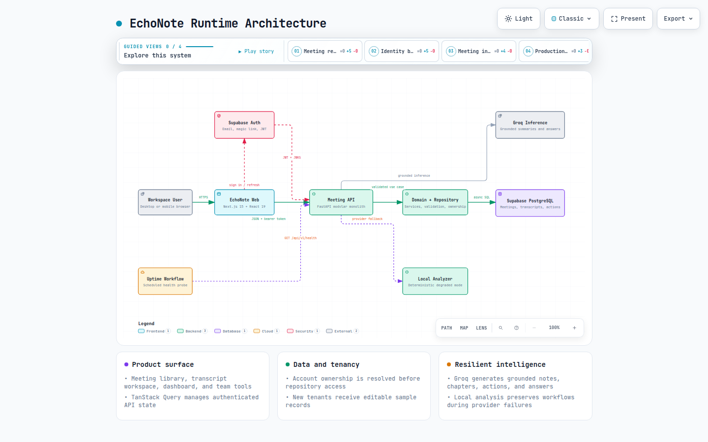

<div align="center">
  
</div>

<p align="center"><strong>Search conversations. Ask with evidence. Turn decisions into action.</strong></p>

[](https://scalarai-project.vercel.app)


EchoNote turns meeting transcripts into an operational workspace. Teams can review synchronized conversations, generate AI notes and chapters, track assigned actions, search exact moments, and ask questions that remain grounded in source evidence.

**[Open EchoNote](https://scalarai-project.vercel.app)** · **[Read the product guide](index.html)** · **[Explore the interactive architecture](docs/architecture/echonote-architecture.html)** · **[View the API](https://scalarai-echonote-api.onrender.com/docs)**



## Demo Access

The demo tenant contains realistic product, customer, design, hiring, engineering, and launch conversations. Every record is persisted in Supabase and can be edited through the application.

| Field | Value |
| --- | --- |
| Application | [https://scalarai-project.vercel.app](https://scalarai-project.vercel.app) |
| Email | `demo@echonote.app` |
| Password | `EchoNoteDemo#2026!` |
| Recommended meeting | `AI Launch Readiness Review` |

## Product Capabilities

| Area | What works |
| --- | --- |
| Meeting library | Search by title, participant, or tag; filter by date, participant, and persisted tags; sort by recency; and inspect task progress |
| Transcript ingestion | Paste dialogue or upload UTF-8 TXT, WebVTT, and structured JSON transcripts |
| Meeting intelligence | Groq generates summaries, key points, chapters, and explicitly owned action items |
| Ask Echo | Answers natural-language questions from tenant-scoped transcript evidence with timestamp sources |
| Transcript workspace | Search and highlight text, use smart filters, edit lines, save moments, and seek by timestamp |
| Follow-through | Create, assign, edit, complete, and delete actions while preserving meeting context |
| Insights | Review speaker time, recurring topics, task signals, questions, metrics, and conversation tone |
| Workspace views | Use the dashboard, calendar, people directory, settings, and global search |
| Export | Download meeting notes and action items as Markdown |
| Appearance | Switch between light and dark workspaces with a preference that survives reloads |
| Responsive UI | Use the complete workspace across desktop and mobile layouts |

Provider integrations are presented as staged connection workflows. Production Google Calendar, Microsoft Teams, Zoom, and Slack data exchange requires each provider's OAuth credentials.

## How It Works

1. **Authenticate** with a Supabase email/password account or magic link.
2. **Add a meeting** by pasting a transcript or uploading TXT, VTT, or JSON.
3. **Review the output** while Groq creates an executive summary, key points, chapters, and assigned actions.
4. **Open the transcript** to search, filter, edit, bookmark, and jump to exact moments.
5. **Ask Echo** a question and follow its source links back to the supporting transcript lines.
6. **Track follow-ups** from the meeting workspace or dashboard until the work is complete.

Personal accounts start with a private, empty meeting library. Users can upload their own transcript or explicitly create an isolated, editable sample workspace from the empty state. The dedicated demo account remains pre-populated; the frontend never renders a shared hardcoded meeting list.

## Architecture

[](docs/architecture/echonote-architecture.html)

The diagram is generated with [Archify](https://github.com/tt-a1i/archify) from a typed source file. The interactive artifact includes guided views, search, relationship tracing, light/dark themes, presentation mode, and image export.

### Request Path

```text
Browser
  -> Next.js + React on Vercel
    -> Supabase Auth session
    -> FastAPI on Render
      -> application service and repository boundary
        -> Supabase PostgreSQL
      -> Groq inference
        -> validated local analysis fallback
```

The frontend owns navigation, interaction state, and query caching. FastAPI owns validation, use cases, authorization, and transaction boundaries. Repository methods scope every operation to the resolved account before SQL is executed.

### AI Reliability

Groq runs exclusively from the backend and receives only the transcript context needed for the requested operation. Provider output is normalized and validated before persistence. If the API key is missing, the provider times out, the quota is exhausted, or structured output is invalid, EchoNote falls back to deterministic local analysis so meeting ingestion and search remain available.

## Technology

| Layer | Technology |
| --- | --- |
| Web | Next.js 15, React 19, TypeScript, TanStack Query, Lucide |
| API | Python 3.12+, FastAPI, Pydantic, SQLAlchemy async |
| Identity | Supabase Auth, asymmetric JWT verification, JWKS |
| Data | Supabase PostgreSQL in production, SQLite for local development and tests |
| Intelligence | Groq Chat Completions with validated structured output and local fallback |
| Delivery | Vercel, Render, GitHub Actions |
| Quality | Vitest, TypeScript, ESLint, Pytest, Ruff, production builds, browser E2E checks |

## Data Model

| Entity | Responsibility |
| --- | --- |
| `Account` | Maps a Supabase identity to one isolated workspace |
| `Meeting` | Owns metadata, media reference, source type, and soft-delete state |
| `Participant` | Represents reusable speaker identity |
| `MeetingParticipant` | Connects attendees to meetings and records the host |
| `TranscriptSegment` | Stores ordered speaker text with start and end timestamps |
| `MeetingSummary` | Stores one generated overview for a meeting |
| `SummaryKeyPoint` | Stores ordered summary evidence |
| `Chapter` | Provides a timestamped meeting outline |
| `ActionItem` | Tracks ownership, due date, and completion state |
| `MeetingMoment` | Persists important transcript bookmarks and notes |
| `Tag` | Stores tenant-scoped reusable meeting labels |
| `MeetingTag` | Connects meetings to persisted tags for filtering and discovery |

## API Surface

Every JSON response follows `{ success, data, error }`.

| Method | Endpoint | Purpose |
| --- | --- | --- |
| `GET` | `/api/v1/me` | Resolve the authenticated application account |
| `GET`, `POST` | `/api/v1/meetings` | List, filter by participant/date/tag, or create meetings |
| `POST` | `/api/v1/meetings/import` | Import TXT, VTT, or JSON transcripts |
| `GET`, `PATCH`, `DELETE` | `/api/v1/meetings/{id}` | Read, update, or soft-delete a meeting |
| `POST` | `/api/v1/meetings/{id}/action-items` | Add a meeting action |
| `PATCH`, `DELETE` | `/api/v1/action-items/{id}` | Update, complete, or remove an action |
| `PATCH` | `/api/v1/transcript-segments/{id}` | Correct transcript text |
| `POST` | `/api/v1/meetings/{id}/moments` | Save a transcript moment |
| `DELETE` | `/api/v1/moments/{id}` | Remove a saved moment |
| `GET` | `/api/v1/search?q=...` | Search transcript evidence across the workspace |
| `POST` | `/api/v1/ask` | Generate a grounded answer with sources |
| `GET` | `/api/v1/health` | Report deployment readiness |

## Local Development

### Prerequisites

- Node.js 22+
- pnpm 10+
- Python 3.12+
- [uv](https://docs.astral.sh/uv/)

### API

```bash
cd backend
cp .env.example .env
uv sync
uv run alembic upgrade head
uv run uvicorn app.main:app --reload --port 8000
```

### Web

```bash
cd frontend
cp .env.example .env.local
corepack enable
pnpm install
pnpm dev
```

Open `http://localhost:3000`. Local API documentation is available at `http://localhost:8000/docs`.

### Environment

```env
# backend/.env
ECHONOTE_DATABASE_URL=sqlite+aiosqlite:///./echonote_v2.db
ECHONOTE_CORS_ORIGINS=http://localhost:3000
ECHONOTE_AUTH_REQUIRED=false
ECHONOTE_GROQ_API_KEY=

# frontend/.env.local
NEXT_PUBLIC_API_URL=http://localhost:8000/api/v1
NEXT_PUBLIC_SUPABASE_URL=
NEXT_PUBLIC_SUPABASE_PUBLISHABLE_KEY=
NEXT_PUBLIC_DEMO_MODE=true
```

Leave `ECHONOTE_GROQ_API_KEY` empty to exercise deterministic fallback behavior locally.

## Verification

```bash
# Frontend
pnpm --dir frontend lint
pnpm --dir frontend exec tsc --noEmit
pnpm --dir frontend test
pnpm --dir frontend build

# Backend
cd backend
uv run ruff format --check .
uv run ruff check .
uv run pytest
```

Current baseline: **13 backend tests and 5 frontend tests passing**, plus clean lint, type checking, formatting, production build, and live browser verification.

## Repository Layout

```text
.
├── backend/                    FastAPI application, migrations, and tests
├── frontend/                   Next.js application and UI tests
├── supabase/                   Database security and RLS migrations
├── docs/architecture/          Archify source and interactive system map
├── docs/decisions/             Architecture decision records
├── docs/specs/                 Product and behavior specifications
├── index.html                  Standalone product guide
└── render.yaml                 Render service definition
```

## Security

- The browser receives only Supabase's publishable key.
- Groq and database credentials stay in backend deployment secrets.
- FastAPI validates JWT issuer, audience, signature, and expiry.
- The JWT subject maps to an application account before repository access.
- Meeting, transcript, action, search, and moment queries are owner-scoped.
- PostgreSQL row-level security provides an additional Data API boundary.
- Imported transcript size and format are validated before processing.

## Deployment

- **Web:** Vercel, with `frontend` as the project root.
- **API:** Render, defined by `render.yaml` and monitored through `/api/v1/health`.
- **Identity and data:** Supabase Auth and PostgreSQL.
- **AI:** Groq, configured as the encrypted `ECHONOTE_GROQ_API_KEY` backend variable.

Detailed setup notes are available in [Supabase production setup](docs/SUPABASE.md) and [architecture documentation](docs/architecture/README.md).
